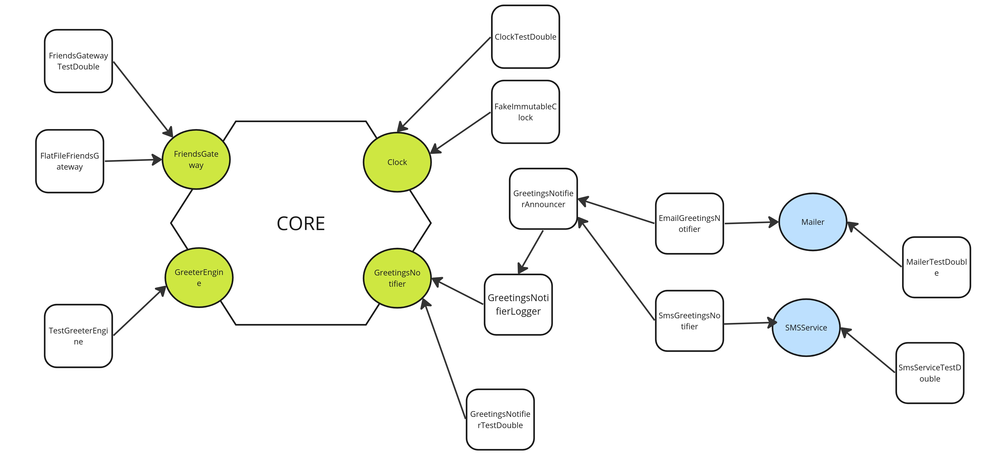

# Birthday Greetings Kata (by Matteo Vaccari)

## Description

This is the the [Birthday Greetings Kata (by Matteo Vaccari)](https://codingdojo.org/kata/birthday-greetings/) solved using Python language.

The code in this repository can be depicted with the following model:

### Model

 
